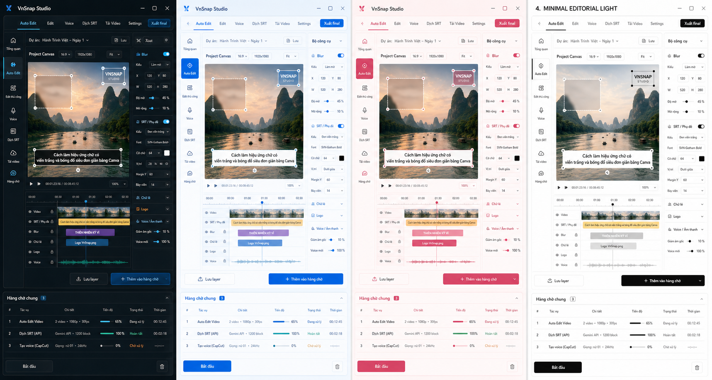

<p align="center">
  
</p>

<h1 align="center">VnSnap Studio</h1>

<p align="center">
  <strong>Video translation, subtitle, voice, download and rendering studio for Windows.</strong><br>
  <strong>Bộ công cụ dịch video, phụ đề, giọng đọc, tải video và render dành cho Windows.</strong>
</p>

<p align="center">
  
  
  
  
</p>

**VnSnap Studio** is a Windows desktop studio for automated video translation, subtitle processing, voice generation, video downloading, and final video rendering.

**VnSnap Studio** là bộ công cụ desktop dành cho Windows, hỗ trợ quy trình làm video dịch tự động: tải video, lấy phụ đề, dịch SRT, tạo voice, chỉnh layer, gắn blur/sub/logo/chữ, ghép audio và xuất video hoàn chỉnh.

> Built by **Codex** and **ThanhDongg**.
>
> Được xây dựng bởi **Codex** và **ThanhDongg**.

> [!IMPORTANT]
> This public repository contains clean source only. API keys, cookies, login sessions, browser profiles, models and private portable builds are intentionally excluded.
>
> Repo công khai chỉ chứa source sạch. API key, cookie, phiên đăng nhập, browser profile, model và bản portable cá nhân được chủ động loại bỏ.

---

## Overview / Tổng Quan

VnSnap Studio is designed for creators who need to process large batches of short or long videos with consistent translation, subtitle, voice, and editing settings.

VnSnap Studio được thiết kế cho người làm nội dung cần xử lý nhiều video, đặc biệt là workflow dịch video, tạo voice, căn phụ đề, che sub gốc và xuất video final một cách nhất quán.

The app has two major workspaces:

- **Auto Edit Video**: an automated pipeline from source video to final translated render.
- **Manual Edit**: detailed tools for editing video, subtitles, blur, audio, text layers, logo, voice, and render settings.

Tool có hai không gian làm việc chính:

- **Auto Edit Video**: pipeline tự động từ video nguồn đến video dịch hoàn chỉnh.
- **Edit thủ công**: bộ công cụ chỉnh chi tiết video, phụ đề, blur, audio, chữ, logo, voice và render.



| Workspace | English | Tiếng Việt |
| --- | --- | --- |
| Auto Edit | End-to-end translated video workflow | Tự động từ video nguồn tới video dịch final |
| Manual Edit | Timeline, layers, audio and render control | Timeline, layer, audio và thiết lập render chi tiết |
| Voice | TikTok, CapCut and local voice generation | Tạo giọng TikTok, CapCut và giọng local |
| SRT | Extraction, translation and styling | Lấy, dịch và định dạng phụ đề |
| Download | Douyin and Bilibili workflows | Tải video Douyin và Bilibili |

---

## Core Workflow / Quy Trình Chính

Typical workflow:

1. Download or import video.
2. Extract subtitles with CapCut-assisted workflow or ASR tools.
3. Translate SRT with Gemini Web or Gemini API.
4. Generate translated voice.
5. Apply blur, subtitle style, logo, text layers, and audio mix.
6. Render final video.

Quy trình thường dùng:

1. Tải video hoặc chọn video local.
2. Lấy phụ đề bằng cơ chế CapCut hoặc ASR.
3. Dịch SRT bằng Gemini Web hoặc Gemini API.
4. Tạo voice dịch.
5. Gắn blur, style phụ đề, logo, chữ lẻ và audio.
6. Render video final.

---

## Feature Map / Danh Sách Chức Năng

### 1. Auto Edit Video

Auto Edit Video is the end-to-end automation workflow.

Auto Edit Video là workflow tự động hóa toàn bộ quá trình xử lý video.

Main features:

- Input Douyin links or local video files.
- Scan source videos and prepare preview.
- Select shared layer presets.
- Configure blur region for original subtitle cover.
- Configure sample subtitle style and position.
- Add text layers, logo layers, and saved layer presets.
- Lower original audio volume for translated voice.
- Add jobs to the shared queue.
- Run a complete pipeline: download/import -> subtitle extraction -> translation -> voice generation -> layer application -> final render.

Chức năng chính:

- Nhập link Douyin hoặc chọn video từ máy.
- Quét video nguồn và tạo preview.
- Chọn layer preset dùng chung.
- Cấu hình vùng blur để che sub gốc.
- Cấu hình style và vị trí phụ đề mẫu.
- Thêm chữ lẻ, logo và layer đã lưu.
- Giảm âm thanh gốc để nghe rõ voice dịch.
- Thêm tác vụ vào hàng chờ chung.
- Chạy pipeline hoàn chỉnh: tải/nhập video -> lấy phụ đề -> dịch -> tạo voice -> gắn layer -> render final.

Auto Edit fallback behavior:

- Translation can fall back between Gemini API and Gemini Web.
- Voice generation can fall back through TikTok no-cookie, TikTok cookie, CapCut Web and CapCut App flows.
- Logs explain why a fallback happened.

Cơ chế fallback của Auto Edit:

- Dịch có thể fallback giữa Gemini API và Gemini Web.
- Tạo voice có thể fallback lần lượt qua TikTok không cookie, TikTok có cookie, CapCut Web và CapCut App.
- Log ghi rõ lý do chuyển fallback.

---

### 2. Manual Video Editor / Edit Video Thủ Công

The manual editor provides detailed control for video rendering.

Khu vực edit thủ công cho phép kiểm soát chi tiết video trước khi xuất final.

Supported functions:

- Add one or multiple videos.
- Sort videos by file name or numeric order in file name.
- Merge videos into timeline.
- Save merge settings before final render.
- Apply speed changes multiple times.
- Apply blur, SRT subtitles, text layers, logo, MP3/voice.
- Render one or multiple final outputs.
- Use CPU/GPU render profile depending on machine resources.
- Choose Fast, Balanced or Quality render profiles.
- Use standard render or segmented Turbo render with hardware-aware concurrency.

Hỗ trợ:

- Thêm một hoặc nhiều video.
- Sắp xếp video theo tên hoặc số thứ tự trong tên file.
- Ghép video vào timeline.
- Lưu thiết lập ghép trước khi xuất final.
- Tăng/giảm tốc nhiều lần.
- Gắn blur, SRT, chữ lẻ, logo, MP3/voice.
- Render một hoặc nhiều video final.
- Dùng profile CPU/GPU tùy tài nguyên máy.
- Chọn profile Nhanh, Cân bằng hoặc Ưu tiên chất lượng.
- Chọn render thường hoặc Turbo chia đoạn với số luồng theo cấu hình máy.

Final render order:

```text
merge videos
-> speed change pass 1
-> apply blur, subtitles, text layers, logo, audio/voice
-> speed change pass 2
-> final export
```

Thứ tự render final:

```text
ghép video
-> chỉnh tốc độ lần 1
-> gắn blur, phụ đề, chữ, logo, audio/voice
-> chỉnh tốc độ lần 2
-> xuất final
```

---

### 3. Preview, Zoom And Layer System / Preview, Zoom Và Layer

The preview system is used to align visible elements before rendering.

Hệ thống preview dùng để căn chỉnh các thành phần hiển thị trước khi render.

Features:

- Drag blur region.
- Resize blur with corner handles.
- Zoom preview.
- Pan preview after zooming.
- Align subtitles, text layers, and logos.
- Save reusable layer presets.
- Share layer presets between Auto Edit and Manual Edit.

Chức năng:

- Kéo vùng blur.
- Kéo góc để resize blur.
- Zoom preview.
- Kéo màn hình preview sau khi zoom.
- Căn phụ đề, chữ lẻ và logo.
- Lưu layer preset.
- Dùng chung layer giữa Auto Edit và Edit thủ công.

---

### 4. SRT Subtitle Styling / Style Phụ Đề SRT

Subtitle tools support SRT import, preview styling, and ASS/FFmpeg export.

Công cụ phụ đề hỗ trợ import SRT, preview style và xuất bằng ASS/FFmpeg.

Supported settings:

- Font size.
- Text color.
- Outline color and width.
- Shadow.
- Background box.
- Subtitle width.
- Subtitle position.
- CapCut-like caption styles such as black-on-white and white-on-black.

Thiết lập hỗ trợ:

- Cỡ chữ.
- Màu chữ.
- Màu và độ dày viền.
- Shadow.
- Nền chữ.
- Độ rộng khung phụ đề.
- Vị trí phụ đề.
- Style giống CapCut như chữ đen nền trắng và chữ trắng nền đen.

---

### 5. Text Layers / Chữ Lẻ

Text layers allow additional standalone captions or labels.

Chữ lẻ dùng để thêm caption hoặc nhãn riêng ngoài phụ đề SRT.

Features:

- Add custom text layer.
- Use saved layer preset.
- Bold and italic styling.
- Text color, outline, shadow, and size.
- Export together with subtitles, blur, logo, and audio.

Chức năng:

- Thêm text layer tùy chỉnh.
- Dùng layer đã lưu.
- In đậm và in nghiêng.
- Màu chữ, viền, shadow và kích thước.
- Xuất cùng phụ đề, blur, logo và audio.

---

### 6. Voice - Giọng Đọc

Voice tools generate speech from text or SRT.

Tab Voice dùng để tạo giọng đọc từ text hoặc SRT.

Available voice providers:

1. TikTok TTS no-cookie flow.
2. TikTok TTS cookie flow.
3. CapCut Web TTS.
4. CapCut App TTS.
5. Local Clone and One Shot voice workflows.

Các provider giọng đọc:

1. TikTok TTS không cookie.
2. TikTok TTS có cookie.
3. CapCut Web TTS.
4. CapCut App TTS.
5. Local Clone và One Shot.

Additional features:

- Save TikTok cookie.
- Open login window for cookie/session capture.
- Select supported voices.
- Generate voice from SRT timing.
- Add voice jobs to the shared queue.
- Log provider errors and fallback reasons.
- Select validated Vietnamese voices and preview each voice before batch rendering.
- Configure parallel workers within the limit supported by each provider.

Chức năng thêm:

- Lưu cookie TikTok.
- Mở cửa sổ login để lấy cookie/session.
- Chọn giọng đọc được hỗ trợ.
- Tạo voice theo timing SRT.
- Thêm tác vụ voice vào hàng chờ chung.
- Log lỗi provider và lý do fallback.
- Chọn các giọng Việt đã kiểm thử và nghe thử trước khi render hàng loạt.
- Chọn số luồng trong giới hạn phù hợp với từng provider.

---

### 7. Merge MP3 By SRT / Ghép MP3 Theo SRT

This tool assembles audio clips according to SRT timing.

Công cụ này ghép audio theo mốc thời gian trong SRT.

Features:

- Merge voice/MP3 clips by SRT timing.
- Align audio with subtitle timestamps.
- Export a combined audio track.
- Use the combined audio in final render.
- Add jobs to the shared queue.

Chức năng:

- Ghép voice/MP3 theo timing SRT.
- Đồng bộ audio với timestamp phụ đề.
- Xuất audio tổng hợp.
- Dùng audio tổng hợp trong render final.
- Thêm tác vụ vào hàng chờ chung.

---

### 8. SRT Translation / Dịch SRT

The SRT translation tab supports Gemini Web and Gemini API workflows.

Tab dịch SRT hỗ trợ Gemini Web và Gemini API.

Gemini Web:

- Uses a separate Chrome/Chromium profile.
- Supports web login.
- Stores browser session separately.

Gemini Web:

- Dùng Chrome/Chromium profile riêng.
- Hỗ trợ đăng nhập web.
- Lưu session trình duyệt riêng.

Gemini API Translator:

- Uses Gemini API keys.
- Uses subtitle-focused prompts.
- Splits long files into blocks.
- Preserves SRT timing and structure.
- Uses delay/retry behavior to reduce request-limit issues.

Gemini API Translator:

- Dùng Gemini API key.
- Dùng prompt chuyên cho phụ đề.
- Chia file dài thành block.
- Giữ timing và cấu trúc SRT.
- Có delay/retry để giảm lỗi giới hạn request.

---

### 9. Video Downloader / Tải Video

The downloader supports Douyin and Bilibili workflows.

Tab tải video hỗ trợ Douyin và Bilibili.

Douyin:

- Single video download.
- Bulk link input.
- Playlist download.
- Profile/page scanning.
- Thumbnail/preview selection.
- Multi-thread download.
- Best available quality.
- No-watermark priority when source allows it.

Douyin:

- Tải video lẻ.
- Nhập nhiều link.
- Tải playlist.
- Quét trang cá nhân/kênh.
- Preview thumbnail để chọn video.
- Tải nhiều luồng.
- Ưu tiên chất lượng cao nhất.
- Ưu tiên không watermark khi nguồn hỗ trợ.

Bilibili:

- Single video download.
- Playlist/series workflow when available.
- Best stream selection.
- FFmpeg muxing without re-encode when possible.

Bilibili:

- Tải video lẻ.
- Tải playlist/series khi nguồn hỗ trợ.
- Ưu tiên stream tốt nhất.
- Ghép video/audio bằng FFmpeg, hạn chế re-encode khi có thể.

---

### 10. Shared Queue / Hàng Chờ Chung

VnSnap Studio uses one shared queue across major tabs.

VnSnap Studio dùng một hàng chờ chung cho nhiều tab.

Supported queued jobs:

- Auto Edit jobs.
- Manual video render jobs.
- Voice/TTS jobs.
- SRT translation jobs.
- Audio merge jobs.
- Related download/render tasks.

Các tác vụ có thể đưa vào hàng chờ:

- Auto Edit.
- Render video thủ công.
- Voice/TTS.
- Dịch SRT.
- Ghép audio.
- Các tác vụ tải/render liên quan.

---

### 11. Settings And Resource Repair / Cài Đặt Và Tài Nguyên

Settings panel manages accounts, themes, and runtime resources.

Khu vực cài đặt quản lý tài khoản, giao diện và tài nguyên chạy tool.

Settings:

- Dark Pro, Aqua Studio, Rose Creator and Minimal Editorial themes.
- CapCut login/session.
- TikTok cookie.
- Gemini Web profile.
- Gemini API keys.
- Douyin session when needed.
- Resource check and repair.

Cài đặt:

- Theme Dark Pro, Aqua Studio, Rose Creator và Minimal Editorial.
- CapCut login/session.
- TikTok cookie.
- Gemini Web profile.
- Gemini API key.
- Douyin session khi cần.
- Kiểm tra và repair tài nguyên.

Resource repair checks:

- FFmpeg / FFprobe.
- Python portable runtime.
- Python dependencies.
- Playwright Chromium.
- Whisper models.
- SenseVoice model.
- PaddleOCR / PaddleX resources.
- Montserrat fonts.
- Required worker scripts.

Tài nguyên được kiểm tra:

- FFmpeg / FFprobe.
- Python portable runtime.
- Python dependency.
- Playwright Chromium.
- Whisper models.
- SenseVoice model.
- PaddleOCR / PaddleX resources.
- Font Montserrat.
- Các worker script bắt buộc.

---

## Clean Source Package / Gói Source Sạch

This GitHub source package intentionally excludes private data and heavy runtime files.

Gói source GitHub này cố ý không chứa dữ liệu riêng tư và runtime nặng.

Included:

```text
index.html
main.js
engine.js
local_vieneu.js
package.json
package-lock.json
resources_manifest.json
assets/
fonts/
tools/
fast_tts/
docs/
.github/
README.md
CHANGELOG.md
SECURITY.md
CONTRIBUTING.md
LICENSE
.gitignore
```

Not included:

```text
user_data/
portable_data/
model_cache/
local_vieneu/
python_runtime/
Release_App/
Portable_Build/
node_modules/
API keys
cookies
login sessions
browser profiles
rendered media
```

---

## Development / Chạy Dev

```powershell
npm install
npm start
```

Some production workflows require runtime resources that are downloaded by the app repair flow.

Một số workflow production cần runtime/model được tải bằng chức năng repair trong app.

---

## Build

```powershell
npm run build
```

The build output uses the Electron package name:

```text
VnSnapStudio
```

---

## Portable Builds / Bản Portable

Private portable builds may include:

- API keys.
- Cookies.
- Login sessions.
- User presets.
- Python runtime.
- Model cache.
- FFmpeg.
- Chromium profiles.

Bản portable cá nhân có thể bao gồm:

- API key.
- Cookie.
- Session đăng nhập.
- Preset cá nhân.
- Python runtime.
- Model cache.
- FFmpeg.
- Chromium profile.

Do not upload private portable builds to GitHub.

Không upload bản portable có dữ liệu người dùng lên GitHub.

---

## Security / Bảo Mật

Before publishing a repository or release, verify:

- no `user_data/`,
- no `portable_data/`,
- no API keys,
- no cookies,
- no login sessions,
- no rendered media,
- no model/runtime cache.

Trước khi public repo hoặc release, kiểm tra:

- không có `user_data/`,
- không có `portable_data/`,
- không có API key,
- không có cookie,
- không có session đăng nhập,
- không có media đã render,
- không có model/runtime cache.

See [SECURITY.md](SECURITY.md).

---

## Documentation / Tài Liệu

- [Architecture / Kiến trúc](docs/ARCHITECTURE.md)
- [Portable build guide / Hướng dẫn portable](docs/PORTABLE_BUILD.md)
- [Release notes / Ghi chú phát hành](docs/RELEASE_NOTES_v1.2.0.md)
- [Security policy / Chính sách bảo mật](SECURITY.md)
- [Contributing / Đóng góp](CONTRIBUTING.md)

## Repository Policy / Chính Sách Repo

GitHub releases and source archives must remain secret-free. Private portable backups that contain API keys, cookies or sessions must never be attached to a public release.

Release và source trên GitHub phải luôn sạch dữ liệu riêng tư. Không được đính kèm bản portable cá nhân chứa API key, cookie hoặc session vào release công khai.

## License

VnSnap Studio is released under the [MIT License](LICENSE).
