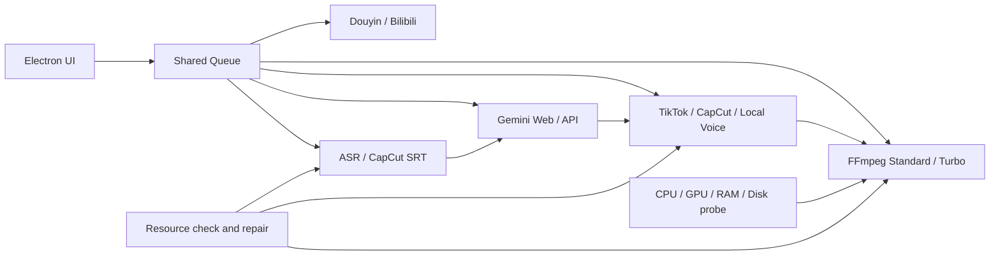

# Architecture / Kiến Trúc

VnSnap Studio is an Electron desktop application that coordinates Node.js workers, Python media/AI tools and FFmpeg render pipelines.

VnSnap Studio là ứng dụng Electron điều phối worker Node.js, công cụ media/AI bằng Python và pipeline render FFmpeg.



## Main Modules / Thành Phần Chính

| Path | Responsibility / Trách nhiệm |
| --- | --- |
| `main.js` | Electron lifecycle, IPC, portable profile and window safety |
| `index.html` | UI, shared queue, Auto Edit and manual workflows |
| `engine.js` | FFmpeg planning, encoding, progress and render orchestration |
| `local_vieneu.js` | Local voice model lifecycle and worker orchestration |
| `fast_tts/` | Batched local voice scheduling, retry, cache and assembly |
| `tools/` | Subtitle, download, CapCut, Gemini and Python worker tools |
| `resources_manifest.json` | Portable dependency and resource contract |

## Auto Edit Pipeline

```text
source video
-> subtitle extraction
-> SRT translation
-> voice generation with fallback
-> blur/subtitle/text/logo/audio composition
-> final render
```

## Portable Boundary / Ranh Giới Portable

Public source contains code and manifests only. A private portable build may additionally include FFmpeg, Python, models, Playwright Chromium and local login profiles. These private resources belong in ignored `user_data/` and `portable_data/` folders and must never be pushed to GitHub.

Source công khai chỉ chứa code và manifest. Bản portable cá nhân có thể kèm FFmpeg, Python, model, Playwright Chromium và profile đăng nhập; các dữ liệu này phải nằm trong thư mục bị Git bỏ qua và không được push lên GitHub.
